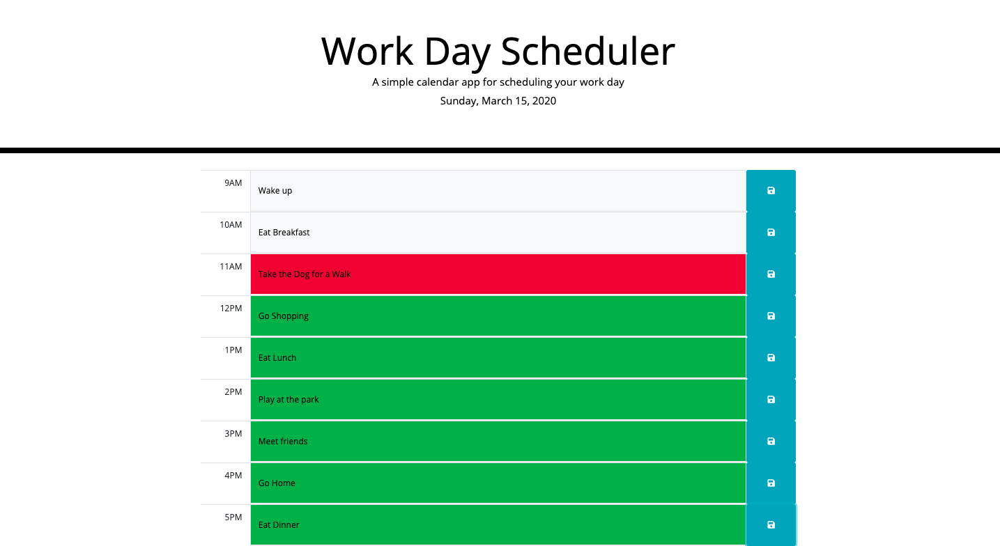

# daily-planner

https://dustinirving.github.io/daily-planner/

This program allows a user to plan out their day. They can save events into a particular timeslot. When they refresh the page those events will stay there. The current day is displayed at the top of the page.

## Explanation
There are 9 hour slots for the user to enter their activity for each hour. The HTML page has 9 rows, one for each time slot. Each row has 3 columns: the time slot, the event and a button to save the event. If the time has past the event is displayed as a gray box. If it is the current hour then, it is displayed as red. Lastly if it is in the future then the box is green. These colors are all updated by the script. When the user enters something into the event box and presses the save button that corresponds to that event, then the event is overwrited. 

## Future Endevers
- Make a calendar, so that the user can update different days instead of just the current day
- Add more specific timeslots, so the user can update a more specified time
- Add holidays to the calendar
- Add reminders for the user
